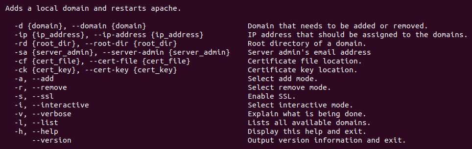

# Local Domains

Local Domains is a simple BASH script for creating local domains on Debian and Debian-based distributions.



Script has been tested on the following distributions:

* Ubuntu 17.10 - 18.04
* Debian 9.3 - 9.5

[](https://www.paypal.me/DjordjeJocic)

## Versioning Scheme

I use a 3-digit [Semantic Versioning](https://semver.org/spec/v2.0.0.html) identifier, for example 1.0.2. These digits have the following meaning:

* The first digit (1) specifies the MAJOR version number.
* The second digit (0) specifies the MINOR version number.
* The third digit (2) specifies the PATCH version number.

Complete documentation can be found by following the link above.

# Examples

This script was made for Debian and Debian-based distributions with LAMP stack installed.

## Example 1 - Adding

In this example, we are adding a local domain **www.my-cool-server.test** with the root directory **/var/www/html/my-cool-server**.

```bash
bash ./local-domains.sh -d www.my-cool-server.test -rd /var/www/html/my-cool-server -v -a
```
Directory **/var/www/html/my-cool-server** will be created if it doesn't already exist.

You can now access **www.my-cool-server.test** from your network.

## Example 2 - Removing

In this example, we are removing a local domain **www.my-cool-server.test**.

```bash
bash ./local-domains.sh -d www.my-cool-server.test -rd /var/www/html/my-cool-server -v -r
```

Apache configuration files and domain will be removed, but the directory **/var/www/html/my-cool-server** will remain unaffected.

## Example 3 - Interactive Mode

Interactive mode has been added to simplify usage of the script. It's an easy way to manage your domains.

```bash
bash ./local-domains.sh -i
```

Parameter for the interactive mode can be combined with other parameters to skip unwanted steps.

## Example 4 - Purging Root Directory

Root directory of a domain can easily be purged, but tread lightly, as all files and folders will be permanently removed from it.

### When Adding

```bash
bash ./local-domains.sh -d www.my-cool-server.test -rd /var/www/html/my-cool-server -v -a -p
```

### When Removing

```bash
bash ./local-domains.sh -d www.my-cool-server.test -v -r -p
```

## Notes

- Enabling SSL is easy, just pass the **-s** or **--ssl** parameter when adding a domain
- Removing a domain will not remove the files from the specified root directory unless you pass the **-p** parameter

If you plan to use this script everyday, you should probably create an alias.

### Temporary Alias

```bash
alias local-domains="/path/to/your/folder/local-domains.sh"
```

### Permanent Alias

```bash
echo alias local-domains="/path/to/your/folder/local-domains.sh" >> ~/.bash_aliases
```

## Installation

Alternatively, you can add my personal APT repository to your machine and install **LocalDomains** like you would anything else.

Add a repository.

```bash
wget -nc https://www.djordjejocic.com/files/apt/Release.key
sudo apt-key add Release.key
sudo echo "deb http://apt.djordjejocic.com general main" >> "/etc/apt/sources.list"
sudo apt-get update
```

Install project.

```bash
apt-get install local-domains
```

## Support

Please don't hessitate to contact me if you have any questions, ideas, or concerns.

My Twitter account is: [@jocic_91](https://www.twitter.com)

My support E-Mail address is: <support@djordjejocic.com>
