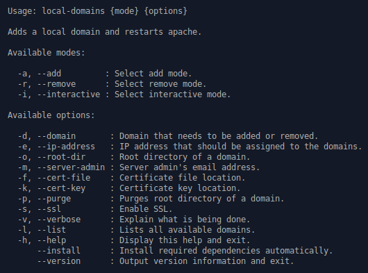

# Local Domains

Local Domains is a simple BASH script for creating local domains on Debian and Debian-based distributions.



# Versioning Scheme

I use a 3-digit version identifier, for example 1.0.1. These digits have the following meaning:

* The first digit (1) specifies the major version number.
* The second digit (0) specifies the minor version number.
* The third digit (1) specifies the patch version number.

# Examples

This script was made for Debian and Debian-based distributions with LAMP stack installed.

## Example 1 - Adding

In this example, we are adding a local domain **www.my-cool-server.test** with the root directory **/var/www/html/my-cool-server***.

```bash
bash ./local-domains.sh -d www.my-cool-server.test -rd /var/www/html/my-cool-server -v
```
Directory ***/var/www/html/my-cool-server*** will be created if it doesn't already exist.

## Example 2 - Removing

In this example, we are removing a local domain **www.my-cool-server.test**.

```bash
bash ./local-domains.sh -d www.my-cool-server.test -rd /var/www/html/my-cool-server -v -r
```

Apache configuration files and domain will be removed, but the directory ***/var/www/html/my-cool-server*** will remain unaffected.
